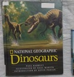
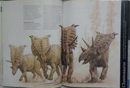
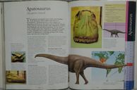

# Dinosaur Books

Not long after my son's second birthday, we introduced him to dinosaurs. He was
already a big fan of animals, but he wasn't so sure about the dinosaurs at
first. Over the course of the next few months, though, he got more and more
excited about them, until at some point he hardly thought about any anything
else. At this point, we basically live a dinosaur life in this house.

Since then, we've plowed through just about every book about dinosaurs and
other prehistoric animals that we could lay our hands on.  As a result, I've
done a lot of research looking for new books to feed his interest. (To be
honest, he doesn't usually complain about the books we have, so much of the
motivation comes from me; I get tired of reading the same books over and over!)

In this document, I've tried to compile as much as I could recall about the
books that we've enjoyed, both for my own record and in the hope that someone
else out there will also be able to take advantage of it and save a bunch of
time. (I don't know how much time I've spent on this endeavor, but it was a
surprisingly huge number of hours.) I've tried to provide Worldcat and Amazon
links to make it easy for you to find these books with a minimum of effort. In
case you're not familiar with Worldcat, you can tell it your location and it
will tell you which local libraries have the book you're looking at, and it
will even give you a link to that book on your local library's website. We
would never have been able to enjoy all of these books without our great local
library system.

 TODO: Movies, TV shows, coloring books, more music 



## Baby books, dinosaur-themed stories

* Stomp, Dinosaur, Stomp / Margaret Mayo
  ([Worldcat](https://www.worldcat.org/title/stomp-dinosaur-stomp/oclc/988922247),
  [Amazon](https://smile.amazon.com/dp/140830385X))
* Dinosaur Days / Joyce Milton (1985 edition:
  [Worldcat](https://www.worldcat.org/title/dinosaurs/oclc/758978206),
  [Amazon](https://smile.amazon.com/dp/B00430CY9I); 2014 edition:
  [Worldcat](https://www.worldcat.org/title/dinosaur-days/oclc/890680143),
  [Amazon](https://smile.amazon.com/dp/0385379234))
  
  The 1985 edition of this book had a lot of staying power early on in our
  dinosaur phase, and we read it so much that my son had it mostly memorized.
  Although it's not in verse, the simple words have a nice cadence. The 1985
  edition is somewhat outdated, but not painfully so, and I prefer its art
  style to the newer one.

* Dinosaurs: 4 favorite stories (Scholastic Reader Collection)
  ([Worldcat](https://www.worldcat.org/title/dinosaurs/oclc/954612918),
  [Amazon](https://smile.amazon.com/Dinosaurs-Grace-Maccarone/dp/0439932513))

  As the title says, a collection of four (older) books. Two have very basic
  artwork and the other two have pretty detailed art. We read these a lot of
  times, and it still comes out occasionally; on the merits the stories aren't
  that great objectively but they have a certain charm to them.

* How Do Dinosaurs...? / Yolen, Jane; Teague, Mark

  Just about all of these books follow the same template: most of the book
  lists ways in which "dinosaurs" might misbehave (posed as question), followed
  by some examples of how they behave correctly. The main draw is the amusing
  illustrations of huge dinosaurs doing things that children do. These are
  probably the most popular recent dinosaur books, and they are available as
  board books.

  * How Do Dinosaurs Say Goodnight?
    ([Worldcat](https://www.worldcat.org/title/how-do-dinosaurs-say-good-night/oclc/712597120),
    [Amazon](https://smile.amazon.com/dp/0590316818))
  * How Do Dinosaurs Go To School?
    ([Worldcat](https://www.worldcat.org/title/how-do-dinosaurs-go-to-school/oclc/809199976),
    [Amazon](https://smile.amazon.com/How-Do-Dinosaurs-Go-School/dp/0439020816))
  * etc.

* All aboard the dinotrain / Lund, Deb

  This is a silly story about dinosaurs riding on a train. Trains plus
  dinosaurs is a winning combo for a lot of kids.

* Chalk / Thomson, Bill

  One of Bill Thomson's stories that's told entirely in pictures. A group of
  kids finds a piece of chalk that makes what they draw come to life. His other
  books that we read (Fossil and The Typewriter) were good also. His art style
  is very realistic.

* Captain Raptor and the Moon Mystery / O'Malley, Kevin

  A comic book space opera for children, featuring a swashbuckling therapod
  protagonist. There's another, Captain Raptor and the Space Pirates, but Moon
  Mystery is a bit more interesting in my opinion and the two are extremely
  similar in structure. The art style is very catchy. I find ordinary comic
  books (DC/Marvel) impossible to read to a young child because of how the
  frames and text work together, but I didn't have that problem with these.

* Meet the Dinotrux / Gall, Chris

  Dinosaurs that are trucks. They behave very
  badly. There are three or four of these books, we read them all.

* Ally-Saurus & the first day of school / Torrey, Rich

  About a girl who pretends to be a dinosaur.

* Dinosaur round-up (DC Super Friends)

  An episode of Super Friends involving dinosaurs. These children's DC comics
  are manageable, they are formatted like regular children's book instead of
  like comic books.

* Time for school, little dinosaur / Herman, Gail ; Fleming, Michael

* A trip to dinosaur time / Foreman, Michael
  ([Worldcat](https://www.worldcat.org/title/trip-to-dinosaur-time/oclc/50936568))
 
  Child travels back through time and sees dinosaurs.

* Danny and the Dinosaur / Hoff
  ([Worldcat](https://www.worldcat.org/title/danny-and-the-dinosaur/oclc/965731837),
  [Worldcat](https://www.worldcat.org/title/danny-and-the-dinosaur-treasury/oclc/123498479),
  [Amazon](https://smile.amazon.com/dp/0064440028))

  This is a classic book (1958). Personally I find it tiresome but I was forced
  to read it many times and I can't deny the fact of its appeal even if I don't
  relate. I suppose part of it is that, as a dinosaur enthusiast, I take
  exception to the dinosaur in the book being some generic "dinosaur" that
  doesn't really resemble any real-life dinosaur species.

## More detailed for kids

* Prehistoric World (Usborne)
  ([Worldcat/2000](https://www.worldcat.org/title/usborne-world-history-prehistoric-world/oclc/896783088),
  [Worldcat/2012](https://www.worldcat.org/title/prehistoric-world/oclc/751835291),
  [Amazon/2000](https://smile.amazon.com/Prehistoric-World-History-Usborne/dp/0746027583),
  [Amazon/2012](https://smile.amazon.com/dp/140953426X))

  I loved the pictures in this book and it got read a lot. It goes from the
  dawn of life through early humans, with plenty of dinosaurs. The 2012 edition
  appears to be basically a reprint of the 2000 edition with a new cover.
  (The 2000 edition, in turn, is a compilation of several older books.)
  Aspects of it are out of date (e.g. we no longer consider dicynodonts to be
  reptiles), but I really like how it covers essentially all of earth's natural
  history, albeit superficially.

* Dinosaurs and Prehistoric Life - Miles Kelly Mini Encyclopedia
    (2015, ISBN 978-1435156418,
    [Worldcat](https://www.worldcat.org/isbn/978-1435156418),
    [Amazon](https://smile.amazon.com/dp/1782096507);
    2014, ISBN 978-1782096504,
    [Worldcat](https://www.worldcat.org/isbn/978-1782096504),
    [Amazon](https://smile.amazon.com/dp/1782096507))

  We probably bought this at a thrift store or something. As a book it's just
  so-so. What's great about it is that it has thick, laminated pages that a
  little kid can handle without tearing. It's small (about 7"x5") but thick
  (384 pages) with lots of stuff in it. When my son was still too young for me
  to trust him to be left alone with regular books, I'd give him this when he
  wanted a dinosaur book to look at by himself or just to carry around the
  house.

* ### Modern Publishing (Rupert Oliver; Ron Wilson; Angela Royston; etc.)

  Omnibus editions of all Modern Publishing books. They are out-of-date (1980s)
  and the illustrations are sometimes goofy but my kid loves them and he really
  appreciates the large selection of animals that they cover. A few of the
  stories are truly memorable, including one (Allosaurus) that is the only
  children's story book I can think of that features the protagonist being
  killed and devoured in the final pages. There's a pretty large number of
  books in the series but I think all of them are collected in the four omnibus
  volumes that I list here.

  * Dinosaurs and Prehistoric Creatures (ISBN 1561447730,
    [Worldcat](https://www.worldcat.org/title/dinosaurs-and-prehistoric-creatures/oclc/18044792),
    [Amazon](https://smile.amazon.com/dp/1561447730))

    Ankylosaurus, Brachiosaurus, Dilophosaurus, Dimetrodon, Diplodocus,
    Plesiosaurus, Protoceratops, Pteranodon, Stegosaurus, Tyrannosaurus

  * Colossal Book of Dinosaurs (ISBN 1561447757,
    [Worldcat](https://www.worldcat.org/title/colossal-book-of-dinosaurs-featuring-the-dinosaur-dictionary/oclc/38498607),
    [Amazon](https://smile.amazon.com/dp/1561447757))

    Anatosaurus ([AKA Edmontosaurus](https://en.wikipedia.org/wiki/Edmontosaurus_annectens#Anatosaurus_to_the_present)),
    Deinonychus, Pachycephalosaurus, Psittacosaurus, Rutiodon, Scolosaurus, Spinosaurus

  * Mammoth Book of Dinosaurs (Featuring Ice Age Creatures) (ISBN 1561447765,
    [Worldcat](https://www.worldcat.org/title/mammoth-book-of-dinosaurs/oclc/868182676),
    [Amazon](https://smile.amazon.com/dp/1561447765)

    Dinosaurs: Albertosaurus, Corythosaurus, Deinosuchus, Nothosaurus, Parasaurolophus, Struthiomimus

    Ice Age Creatures: Glyptodon, Mastodon, Saber Tooth Tiger, Woolly Rhinoceros

  * Dinosaurs Of The Land, Sea And Air (ISBN 1561447749,
    [Worldcat](https://www.worldcat.org/title/dinosaurs-of-the-land-sea-and-air/oclc/609080515),
    [Amazon](https://smile.amazon.com/dp/1561447749))

    Allosaurus, Archaeopteryx, Brontosaurus, Chasmosaurus, Dimorphodon,
    Hypsolophodon, Ichthyosaurus, Iguandon, Mamenchisaurus, Triceratops

  * Images from various stories in the series:

    
    
    
    
    
    
    
    

* ### Don Lessem

    * The Ultimate Dinopedia / Lessem and Tampesta
        (1e/2010 ISBN 1426301642,
        [Worldcat](https://www.worldcat.org/title/ultimate-dinopedia-the-most-complete-dinosaur-reference-ever/oclc/769762610),
        [Amazon](https://smile.amazon.com/dp/1426301642);
        \[FORTHCOMING] 2e/2017 ISBN 1426329059,
        [Worldcat](https://www.worldcat.org/title/national-geographic-kids-ultimate-dinopedia/oclc/969372009),
        [Amazon](https://smile.amazon.com/dp/1426329059))

      Full-page artwork of each dinosaur in action, along with pronunciation
      guides and entertaining text, make this a pretty ideal first "encyclopedia"
      type dinosaur book for both parent and child. I notice that there's a new
      edition (2nd, 2017) but I haven't seen it yet. I've noticed that the Franco
      Tempesta illustrations in this book show up in some National Geographic Kids
      books. (Reusing dinosaur illustrations happens a lot, read enough of these
      books and you'll start to see it all over the
      place!)

  * The Dinosaur Atlas 

    I haven't seen this yet, but I love the idea. We talk a lot about where
    dinosaurs lived, but it would be nice to see them on a map.

  * Meet the Dinosaurs series (illustrated by John Bindon)
  
    Good books that list and discuss dinosaurs (and non-dinosaurs) of particular classifications.

    * Sea Giants of Dinosaur Time (ISBN 9780822514251,
        [Worldcat](https://www.worldcat.org/title/sea-giants-of-dinosaur-time/oclc/56095792),
        [Amazon](https://smile.amazon.com/dp/0822514257))
    * The Smartest Dinosaurs (ISBN 978-0822513735,
        [Worldcat](https://www.worldcat.org/isbn/978-0822513735),
        [Amazon](https://www.amazon.com/Smartest-Dinosaurs-Meet/dp/0822513730))
    * Horned Dinosaurs (ISBN 978-0822513704,
        [Worldcat](https://www.worldcat.org/isbn/978-0822513704),
        [Amazon](https://www.amazon.com/Horned-Dinosaurs-Meet-Don-Lessem/dp/0822513706))
    * Armored Dinosaurs (ISBN 978-0822513742,
        [Worldcat](https://www.worldcat.org/isbn/978-0822513742),
        [Amazon](https://www.amazon.com/Armored-Dinosaurs-Meet-Don-Lessem/dp/0822513749))
    * The Deadliest Dinosaurs (ISBN 978-0822514213,
        [Worldcat](https://www.worldcat.org/isbn/978-0822514213),
        [Amazon](https://www.amazon.com/Deadliest-Dinosaurs-Meet/dp/0822514214))
    * Giant Meat-Eating Dinosaurs (ISBN 978-0822525721,
        [Worldcat](https://www.worldcat.org/isbn/),
        [Amazon](https://www.amazon.com/Giant-Meat-Eating-Dinosaurs-Meet/dp/0822525720))
    * Duck-Billed Dinosaurs (ISBN 978-0822513698,
        [Worldcat](https://www.worldcat.org/isbn/),
        [Amazon](https://www.amazon.com/Duck-Billed-Dinosaurs-Meet-Don-Lessem/dp/0822513692))
    * Giant Plant-Eating Dinosaurs (ISBN 978-0822525738,
        [Worldcat](https://www.worldcat.org/isbn/),
        [Amazon](https://www.amazon.com/Giant-Plant-Eating-Dinosaurs-Meet/dp/0822525739))
    * The Fastest Dinosaurs (ISBN 978-0822514220,
        [Worldcat](https://www.worldcat.org/isbn/),
        [Amazon](https://www.amazon.com/Fastest-Dinosaurs-Meet/dp/0822514222))
    * Feathered Dinosaurs (ISBN 978-0822514237,
        [Worldcat](https://www.worldcat.org/isbn/),
        [Amazon](https://www.amazon.com/Feathered-Dinosaurs-Meet-Don-Lessem/dp/0822514230))

  * Dinosaurs to Dodos: An Encyclopedia of Extinct Animals / Lessem and Sovak (ISBN 9780590316842 HC / 9780590316859 PB, [Worldcat](https://www.worldcat.org/title/dinosaurs-to-dodos-an-encyclopedia-of-extinct-animals/oclc/39281870), [Amazon](https://smile.amazon.com/dp/0590316842)) - A pretty good book with nice pictures, but The Ultimate Dinopedia is newer and has bigger pictures.

* National Geographic Dinosaurs / Paul Barrett, Raul Martin (illustrator)
    (2001, ISBN 978-0792282242, [Worldcat](https://www.worldcat.org/title/national-geographic-dinosaurs/oclc/818882284),
    [Amazon](https://smile.amazon.com/National-Geographic-Dinosaurs-Paul-Barrett/dp/0792282248))

  This is an excellent informational book that has continued to teach us new
  things even though we're already pretty far into reading about dinosaurs.
  The author has also written a good academic textbook about dinosaurs (listed
  below). Like a lot of books, it's a mix of thematic information and a
  dinosaur-by-dinosaur guide. Its guide portion has pretty good pictures,
  including a scale representation of each dinosaur next to a human (I've
  struggled so much to explain scale so this is really important for a little
  kid). It also contains lots of two-page spreads of nice dinosaur artwork.
  The text is brief and interesting enough that I can often read all or at
  least most of a page before the 3-year-old audience loses interest.

  
  
  
  
* Juan Carlos Alonso and Gregory S. Paul, *Ancient Earth Journal* (these each have two editions, and the second editions are broken up into multiple volumes)
  
  * Ancient Earth Journal: The Early Cretaceous: Notes, drawings, and observations from prehistory
  * Ancient Earth Journal: The Late Jurassic: Notes, drawings, and observations from prehistory

* ### Dougal Dixon

  Dougal Dixon is a very prolific author of dinosaur books. His books are
  generally pretty good in content but he sometimes makes errors and some
  volumes feature lousy digital art.

  * Reptiles rule: Triassic life; etc. (Awesome Ancient Animals)

  * Stegosaurus : and other plains dinosaurs; etc. (Dinosaur Find) - These books are basically collections of detailed scenes full of lots of dinosaurs, without much text. They are pretty good for a kid who just wants to look at the pictures and talk about what's in them.

  * Complete Illustrated Encyclopedia
    ([Worldcat](https://www.worldcat.org/oclc/944351418),
    [Amazon](https://smile.amazon.com/dp/1846812097))

    The format of the new (2014) paperback edition of this one is really too
    small for what it is (6.8 x 8.5 inches), but it is cheap. It covers a very
    large number of dinosaur species, which makes it a wide-ranging reference,
    but it's not the most attractive for children and it doesn't have a lot to
    say about each species.

* Dinosaurs Through Time / Rupert Matthews, McRae Books
    (ISBN 8860980429, [Amazon](https://smile.amazon.com/dp/8860980429))

  General overview of Mesozoic animal life, organized chronologically. It
  coverage doesn't really stand out, but nice full-page artwork makes it
  worthwhile. (Note that this is an oversize book so those full pages are big,
  although the book isn't heavy).  It actually begins with the Permian, before
  dinosaurs first appeared.  One criticism I have is that some of the images
  are clearly old and out-of-date even though this is a recent book (for
  example the Spinosaurus).

  
  
  

* Dinosaurs Through Time / Harris, Nicholas ; Scott, Peter David ; Dennis, Peter ([Amazon](https://smile.amazon.com/dp/143582802X))

  Story of the life of a Mamenchisaurus from birth to death to fossilization.
  This book is fairly brief, and each two-page spread shows a scene in the
  dinosaur's life. It is nicely illustrated and thought-provoking.

* Zoehfeld and Washburn (Let's Read and Find Out Science) - Excellent book that each focus on a fairly narrow topic.
  * Where did dinosaurs come from? ([Worldcat](https://www.worldcat.org/title/where-did-dinosaurs-come-from/oclc/813919873), [Amazon](https://smile.amazon.com/dp/0064452166)) - History of evolution up until the dinosaurs.
  * Dinosaurs big and small ([Worldcat](https://www.worldcat.org/title/dinosaurs-big-and-small/oclc/966744777), [Amazon](https://smile.amazon.com/dp/0064451828)) - Overview of various dinosaurs.
  * etc.

* Life-Size dinosaurs / Bergen, David ([Worldcat](https://www.worldcat.org/title/life-size-dinosaurs/oclc/56389198), [Amazon](https://smile.amazon.com/dp/140271775X))

  The selling point of this series (Life-Size) is that the pictures are
  literally life-size. Instead of showing a scaled-down picture of a
  Tyrannosaurus, for example, it shows its teeth filling the entire page. In
  fact, this book has many pages that fold out to create 4-page-wide spreads
  for some of the really huge pictures. The fold-outs mean that it takes
  somewhat more effort to read this to a little kid (you have to stop them from
  destroying it in the process) but those huge pictures are a lot of fun. Since
  little kids struggle to really grasp the concept of drawing things to scale,
  this is one time when you can forget that and really see how big things are.
  Even for the adult, seeing something at its actual size has a real
  psychological impact that's a lot of fun.

* ### Hannah Bonner

  * #### A Cartoon Prehistory of Life

    I appreciated this series a lot because it emphasizes the major periods of
    evolution rather than individual species. It's a really fresh presentation
    that I would've liked to spend more time with. However, I found it
    difficult to explain to my son because it has many humorous cartoons. Jokes
    are always difficult to explain because it's hard to convey what should and
    shouldn't be taken literally; because of this, I feel like this is better
    suited to somewhat older children. Still worth a look for the little ones,
    but don't expect them to fully appreciate it. I'll probably check it out
    from the library again in a year or two and see how it goes.

    * 2012 omnibus: *When Fish Got Feet, When Bugs Were Big, and When Dinos
      Dawned* (ISBN 1426321058,
        [Worldcat](https://www.worldcat.org/title/oclc/973542194),
        [Amazon](https://smile.amazon.com/When-Fish-Feet-Dinos-Dawned/dp/1426321058))
    * Individual books
      * *When fish got feet, sharks got teeth, and bugs began to swarm: a cartoon prehistory of life long before dinosaurs* (ISBN 1426300794, [Worldcat](https://www.worldcat.org/title/when-fish-got-feet-sharks-got-teeth-and-bugs-began-to-swarm-a-cartoon-prehistory-of-life-long-before-dinosaurs/oclc/474543162), [Amazon](https://smile.amazon.com/dp/1426300794))
      * *When bugs were big, plants were strange, and tetrapods stalked the earth: a cartoon prehistory of life before dinosaurs* (ISBN 079226326X, [Worldcat](https://www.worldcat.org/title/when-bugs-were-big-plants-were-strange-and-tetrapods-stalked-the-earth-a-cartoon-prehistory-of-life-before-dinosaurs/oclc/426120932), [Amazon](https://smile.amazon.com/dp/079226326X))
      * *When dinos dawned, mammals got munched, and pterosaurs took flight: a cartoon prehistory of life in the Triassic* (ISBN 1426308620, [Worldcat](https://www.worldcat.org/title/when-dinos-dawned-mammals-got-munched-and-pterosaurs-took-flight-a-cartoon-pre-history-of-life-in-the-triassic/oclc/886776103), [Amazon](https://smile.amazon.com/dp/1426308620))

  * *Dining With Dinosaurs: A Tasty Guide to Mesozoic Munching* (ISBN 1426323395, [Worldcat](https://www.worldcat.org/title/dining-with-dinosaurs-a-tasty-guide-to-mesozoic-munching/oclc/959966623), [Amazon](https://smile.amazon.com/dp/1426323395)) - I haven't seen this new book yet but it looks similar to her others.
  
* Can you tell a Brachiosaurus from an Apatosaurus? / Silverman, Buffy ([Worldcat](https://www.worldcat.org/title/can-you-tell-brachiosaurus-from-a-apatosaurus/oclc/988929776)) - A question that I asked a lot when we first started reading dinosaur books.
* Dinosaurs and other prehistoric creatures / Bergin, Mark -- Easy-to-follow dinosaur drawing book. (ISBN  9781435826465, [Worldcat](https://www.worldcat.org/title/dinosaurs-and-other-prehistoric-creatures/oclc/212893645))

* I Am a Tyrannosaurus / Wallace, Karen ; Bostock, Mike ([Worldcat](https://www.worldcat.org/title/i-am-a-tyrannosaurus/oclc/61439566))

  A gripping first-person account of the life and times of a tyrannosaurus. Don't read it if you don't want to see a tyrannosaurs devouring a baby triceratops. (But you probaby do want to see that.)

* Imagine you are a crocodile / Wallace, Karen ; Bostock, Mike <https://www.worldcat.org/title/imagine-you-are-a-crocodile/oclc/51527511>

* I am an ankylosaurus / Wallace, Karen ; Bostock, Mike <https://www.worldcat.org/title/i-am-an-ankylosaurus/oclc/52782911>

* Dinosaurs / Long, John (ISBN 9781416938576, [Worldcat](https://www.worldcat.org/title/dinosaurs/oclc/122715493))

  An average dinosaur book that we got some entertainment from.

* Monster fliers: from the time of the dinosaurs / MacLeod, Elizabeth ; Bindon, John <https://www.worldcat.org/title/monster-fliers-from-the-time-of-the-dinosaurs/oclc/394994459> - Nice illustrations of pterosaurs.
* Beyond the dinosaurs: monsters of the air and sea / Brown, Charlotte Lewis ; Wilson, Phil <https://www.worldcat.org/title/beyond-the-dinosaurs-monsters-of-the-air-and-sea/oclc/948653918>
* The day the dinosaurs died / Brown, Charlotte Lewis ; Wilson, Phil <https://www.worldcat.org/title/day-the-dinosaurs-died/oclc/868345981>
* Tyrannosaurus time / Joanne Ryder; Michael Rothman <https://www.worldcat.org/title/tyrannosaurus-time/oclc/43032305>
* Paleo sharks: survival of the strangest / Timothy J Bradley (2007, ISBN 0811848787, [Worldcat](https://www.worldcat.org/title/paleo-sharks-survival-of-the-strangest/oclc/66392993))
* ISBN 9781625880826 1625880820 9781625881090 1625881096 (???), <https://www.worldcat.org/title/before-the-dinosaurs/oclc/858081253>
* Dinosaurs / Milner, Angela C (ISBN 078354765X, <https://www.worldcat.org/title/dinosaurs/oclc/973033291>)
* The Amazing World of Dinosaurs: An Illustrated Journey Through the Mesozoic Era / Kuether ([ISBN 9781591936459](https://www.worldcat.org/isbn/9781591936459), [Amazon](https://smile.amazon.com/Amazing-World-Dinosaurs-Illustrated-Mesozoic/dp/1591936454))

## Adult books with enough pictures to be of some interest to kids

* Dinosaurs : the most complete, up-to-date encyclopedia for dinosaur lovers of all ages / Holtz, Thomas R ; Rey, Luis V

  A bit of false adversiting here: this is not really great for all ages, as
  the format is not very kid-friendly. Most of the above books have a layout
  that presents information a page or two at a time, but this one is organized
  in chapters with text flowing around inset images, like a typical adult book.
  This means you won't actually be reading the text to a young child. However,
  it still has enough pictures that you can have fun paging through it, talking
  about the pictures and reading the captions. Each chapter has a picture of
  several related dinosaurs side-by-side, those are fun to look at.

* Dinosaurs: 

## Beyond kids

* Life of the Past series: An amazing series of serious, high-quality paleontology books that are still accessible to the motivated layperson.

  * Steyer. *Earth Before the Dinosaurs* (ISBN 9780253223807,
    [Worldcat](https://www.worldcat.org/title/earth-before-the-dinosaurs/oclc/798740419),
    [Amazon](https://smile.amazon.com/dp/0253223806))

* Paul. *The Princeton Field Guide to Dinosaurs* (2nd edition: ISBN 9780691167664, [Worldcat](https://www.worldcat.org/title/princeton-field-guide-to-dinosaurs/oclc/985402380), [Amazon](https://smile.amazon.com/Princeton-Field-Guide-Dinosaurs-Second/dp/0691167664))
* Hone. *The Tyrannosaur Chronicles: The Biology of the Tyrant Dinosaurs* (ISBN 9781472911254, [Worldcat](https://www.worldcat.org/title/tyrannosaur-chronicles-the-biology-of-the-tyrant-dinosaurs/oclc/951803248), [Amazon](https://smile.amazon.com/Tyrannosaur-Chronicles-Biology-Tyrant-Dinosaurs/dp/1472911253))

## Textbooks

My son asks so many questions about dinosaurs that I decided I had to get out
ahead of him by reading some serious books about dinosaurs and other animals.
Here's what I found along those lines.

I don't have much background in anatomy, and these contain lots of terminology
that I'm not familiar with. If you're in the same boat, then Kardong's
vertebrate anatomy book (ISBN 9780073040585,
[Worldcat](https://www.worldcat.org/title/vertebrates-comparative-anatomy-function-evolution/oclc/901203971),
[Amazon](https://smile.amazon.com/dp/0073040584))
should be helpful. (It's an excellent book in any case.)

* Naish, Barrett. *Dinosaurs: How They Lived and Evolved* (2016, ISBN
  9781588345820,
  [Worldcat](https://www.worldcat.org/title/dinosaurs-how-they-lived-and-evolved/oclc/961155529),
  [Amazon](https://smile.amazon.com/dp/1588345823))

  Probably the best place to start!  This is a really excellent introduction to
  dinosaurs, especially for anyone who doesn't have a biology/anatomy
  background. It has the kind of depth that you expect from an introductory
  textbook (comparable to Fastovsky and Weishampel) but it's pitched as a
  popular book so it doesn't make too many assumptions about prerequisites
  (e.g. anatomical terms). It's also very recent (as of this writing) so it
  covers a lot of the latest developments.

  
  

* Fastovsky, Weishampel, Sibbick (illustrator). *Dinosaurs: a concise natural history*

  Excellent and entertaining overview of dinosaurs. Begins with an good
  overview of the different classifications of dinosaurs, discussing their
  features and cladograms, with a particular emphasis on what they ate. Has
  comparative illustrations of the skulls of many species. I read the first
  edition, which was great, but no doubt the later ones are more up-to-date.

  * 3e/2016: ISBN 9781107135376 (HC) / 9781316501153 (PB), 
      [Worldcat](https://www.worldcat.org/oclc/936687221), 
      [Amazon HC](https://smile.amazon.com/dp/1107135370), 
      [Amazon PB](https://smile.amazon.com/dp/1316501159)
  * 2e/2012: ISBN 9781107010796 (HC), 9780521282376 (PB), 
      [Worldcat](https://www.worldcat.org/oclc/912478799), 
      [Amazon HC](https://smile.amazon.com/dp/1107010799), 
      [Amazon PB](https://smile.amazon.com/dp/0521282373)
  * 1e/2009: ISBN 9780521889964 (HC) / 9780521719025 (PB), 
      [Worldcat](https://www.worldcat.org/oclc/845004724), 
      [Amazon HC](https://smile.amazon.com/dp/B01FJ18ALU), 
      [Amazon PB](https://smile.amazon.com/dp/052171902X)

    
    
    

* Brusatte. *Dinosaur Paleobiology*
    (2012, ISBN 9780470656587, [Amazon](https://smile.amazon.com/dp/0470656581))
* Weishampel, Dodson, Osmólska (eds). *The Dinosauria*
    (2e/2007: ISBN 9780520254084, [Amazon](https://smile.amazon.com/dp/0520254082))
* Cowen. *History of Life*
    (5e/2013: ISBN 9780470671726, [Amazon](https://smile.amazon.com/dp/0470671726))
* Prothero. *Bringing Fossils to Life: An Introduction to Paleobiology*
    (3e/2013, ISBN 9780231158930, [Amazon](https://smile.amazon.com/dp/0231158939))

* Romer. *Vertebrate Paleontology* (1966, ISBN 9780226724881,
  [Worldcat](https://www.worldcat.org/title/vertebrate-paleontology/oclc/41942716),
  [Amazon](https://www.amazon.com/dp/0226724883))

  My impression from reading about this book is that, while it's outdated, it's
  still considered great and it's the book that a generation of paleontologists
  learned from.

* Carroll. *Vertebrate Paleontology and Evolution* (1990, ISBN 978-0716718222,
  [Worldcat](https://www.worldcat.org/title/vertebrate-paleontology-and-evolution/oclc/922750908),
  [Amazon](https://www.amazon.com/dp/0716718227))

  A more recent classic paleontology book, though also outdated.

* Benton. *Vertebrate Paleontology* (3e/2014: ISBN 9781118406847,
  [Amazon](https://smile.amazon.com/dp/1118406842))

  Seems the be the standard textbook for the field currently.


## TODO

* Hallett, Wedel. *The Sauropod Dinosaurs: Life in the Age of Giants* (ISBN 9781421420288, <https://smile.amazon.com/Sauropod-Dinosaurs-Life-Age-Giants/dp/1421420287>)
* <https://smile.amazon.com/Pterosaurs-Natural-History-Evolution-Anatomy/dp/0691150613>
* <https://smile.amazon.com/dp/0195372662>
* <https://smile.amazon.com/Field-Guide-Mesozoic-Winged-Dinosaurs/dp/0988596504>
* Pickrell. *Flying Dinosaurs: How Fearsome Reptiles Became Birds* (2014, ISBN 9780231171786, <https://smile.amazon.com/dp/0231171781>)
* Pickrell. *Weird Dinosaurs: The Strange New Fossils Challenging Everything We Thought We Knew* (2017, ISBN 9780231180986, <https://smile.amazon.com/dp/0231180985>)
* <https://smile.amazon.com/Cambrian-Explosion-Construction-Animal-Biodiversity/dp/1936221039>
* <https://smile.amazon.com/Cambrian-Ocean-World-Ancient-America/dp/0253011825>
* Brett-Surman, Holtz, Farlow (eds). *The Complete Dinosaur* (Life of the Past) (2e/2012: ISBN 9780253357014, [Amazon](https://smile.amazon.com/dp/0253357012))


## Music

* *Most amazing dinosaur songs* (Music for Little People) (ISBN 9781566284059, [Worldcat](https://www.worldcat.org/title/most-amazing-dinosaur-songs/oclc/55769455)) - Classic children's songs with words about dinosaurs.

## Other animals

* Coyote raid in Cactus Canyon / Jim Arnosky (ISBN 0399234136, [Worldcat](https://www.worldcat.org/title/coyote-raid-in-cactus-canyon/oclc/54022367)) - also many other Jim Arnosky books
* Baby sea otter / Betty Tatham; Joan Paley (ISBN 9780805075045, [Worldcat](https://www.worldcat.org/title/baby-sea-otter/oclc/56753287))
* Rosa Raposa / Campoy; Aruego; Dewey (ISBN 9780152021610, [Worldcat](https://www.worldcat.org/title/rosa-raposa/oclc/47930701))
* Platypus! / Clarke, Ginjer L ; Mirocha, Paul (ISBN 9780375924170 / 9780375824173, [Worldcat](https://www.worldcat.org/title/platypus/oclc/52970766))
* The emperor lays an egg / Guiberson, Brenda Z ; Paley, Joan <https://www.worldcat.org/title/emperor-lays-an-egg/oclc/57357701>
* Reptiles & amphibians / Cogger, Harold G (ISBN 1875137580, [Worldcat](https://www.worldcat.org/title/reptiles-amphibians/oclc/41880357))
* Birds: nature's magnificent flying machines / Caroline Arnold; Patricia Wynne (ISBN 1570915164, [Worldcat](https://www.worldcat.org/title/birds-natures-magnificent-flying-machines/oclc/50198991))
* The animal book: a visual encyclopedia of life on Earth / Burnie, David (ISBN 9781465414571, [Worldcat](https://www.worldcat.org/title/animal-book-a-visual-encyclopedia-of-life-on-earth/oclc/828055604))
* What if you had animal teeth!? / Markle, Sandra ; McWilliam, Howard (2013, ISBN 9780606315043, [Worldcat](https://www.worldcat.org/title/what-if-you-had-animal-teeth/oclc/797334991))
* Lizards / Joanne Mattern (ISBN 9780761412595, [Worldcat](https://www.worldcat.org/title/lizards/oclc/45413523))
* The beginner's guide to animal autopsy : a "hands-in" approach to zoology, the world of creatures and what's inside them / Parker, Steve ; Shone, Rob (ISBN 0761307028, [Worldcat](https://www.worldcat.org/title/beginners-guide-to-animal-autopsy-the-hands-in-approach-to-zoology/oclc/36573705))
* Life-size killer creatures / Gilpin, Daniel (Omnibus: [Amazon](https://smile.amazon.com/dp/B001YIGW2C))
* Bateman - Deep in the Swamp
* Steve Jenkins, *Down, Down, Down*, and other books
* Gail Gibbons

* DK-Smithsonian Natural History

  An incredible compendium of a huge variety of all kingdoms life, but mostly
  animals. The beginning includes a brief overview of earth science as well. If
  you want to spend hours looking at different animals, this is your book. We
  spend a lot of time looking at the whales. There aren't a lot of words to
  read, although there are brief descriptions of a good number of the species
  depicted.

  Be aware that this is a **big**, heavy book. Little kids will not be able to hold it comfortably on their laps.

  
  
  
  
  
  
  
  

* National Geographic Prehistoric Mammals / Alan Turner, Mauricio Anton (illustrator)

  A very nice book about prehistoric mammals that follows the same basic design as [Paul Barrett's dinosaurs book](#barrett-ng-dinosaurs).

  
  
  
  

* Usborne Mysteries & Marvels of Nature (1989, ISBN 978-0746004210,
    [Worldcat](https://www.worldcat.org/isbn/978-0746004210),
    [Amazon](https://smile.amazon.com/dp/0746004214))

  I'm pretty sure this is the original version of this book, and it's the one
  we have. It appears to have been original published as several separate books
  ([this reptiles book, for example](https://www.worldcat.org/isbn/978-0860208457))
  which were then combined into this volume. The layout mingles
  realistic-looking illustrations showing scenes of animal and plant life with
  silly cartoonish illustrations, all intermixed with text describing
  remarkable facts about nature.

  This was one of the first animal books that we spent a lot of time reading.
  The nature of the illustrations provokes lots of questions.

* Usborne Internet-Linked Mysteries & Marvels of Nature
    (2003, ISBN 978-0746052983, [Worldcat](https://www.worldcat.org/isbn/978-0746052983),
    [Amazon](https://smile.amazon.com/dp/0746052987);
    2004, ISBN 978-0794505974, [Worldcat](https://www.worldcat.org/isbn/978-0794505974),
    [Amazon](https://smile.amazon.com/dp/079450597X);
    2007, ISBN 978-0794517380, [Worldcat](https://www.worldcat.org/isbn/978-0794517380),
    [Amazon](https://smile.amazon.com/dp/0794517382))

  This looks to be a true second edition of the original 1980's version of this
  title. The layout combines photographic images with hand-drawn illustrations.
  I haven't seen the real things yet, I'm just going off of the images I see
  online.

* 4000 Things You Should Know About Animals
    (2003, ISBN 978-1842363645, [Worldcat](https://www.worldcat.org/isbn/978-1842363645),
    [Amazon](https://smile.amazon.com/dp/1842363646);
    2002, ISBN 978-1842361504, [Worldcat](https://www.worldcat.org/isbn/978-1842361504),
    [Amazon](https://smile.amazon.com/dp/1842361503))

  This was one of our first dinosaur books, so for a while the dinosaur section
  was a regular part of our reading rotation.  We found it on a clearance shelf
  at Half Price Books.  It has four sections: Dinosaurs, Birds, Wild Animals,
  Mammals.  The illustrations are a bit small, and probably mostly stock images
  (I've definitely seen that Argentinosaurus elsewhere), but there are a lot of
  them.  There's no coherent text, it's all just a collection of bullet points.
  Because of this, you wouldn't wanna read it cover-to-cover, but for the kind
  of browsing that kids like to do it works pretty well; you just turn to
  whatever page they want and read a few bullet points before they decide to
  move on.  I don't think I would buy it now that I know so many other great
  books, but we did read it so much for a while that I figured I should mention
  it.


## TODO

* <https://smile.amazon.com/Day-Dinosaurs-spectacular-prehistoric-Science/dp/184780845X>
* <https://smile.amazon.com/dp/1909263915>
* <https://smile.amazon.com/dp/1847808409>
* <https://smile.amazon.com/Best-Book-Early-People/dp/0753455773>


## Human body - intro

* My amazing body / Ruth Martin; Allan Sanders
  (2015, ISBN 9781499800401, [Worldcat](https://www.worldcat.org/title/my-amazing-body/oclc/966196689))
* Human body encyclopedia / Penny Smith (2005, ISBN 0756609976, [Worldcat](https://www.worldcat.org/title/human-body-encyclopedia/oclc/56096099))

## Human body - older

* Human body book / Parker, Steve (2013, ISBN 9781465402134, [Worldcat](https://www.worldcat.org/title/human-body-book/oclc/854541818))
* The way we work: getting to know the amazing human body / Macaulay, David; Walker, Richard (2008, ISBN 9780618233786, [Worldcat](https://www.worldcat.org/title/human-body-book/oclc/854541818))



